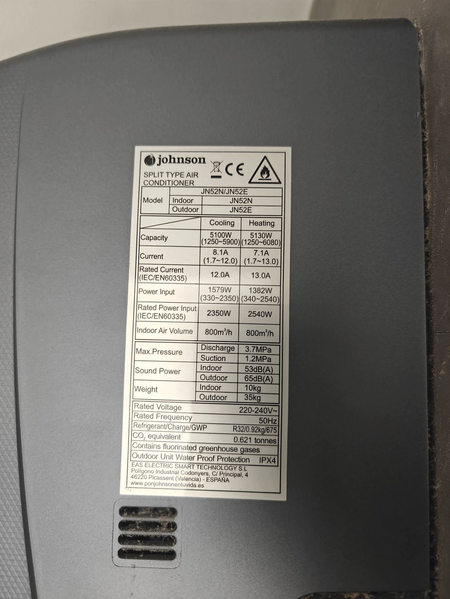
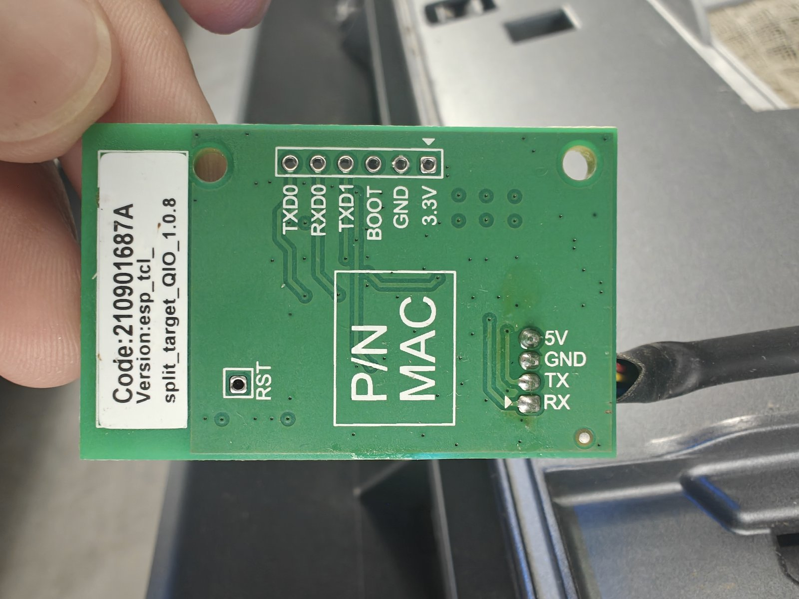
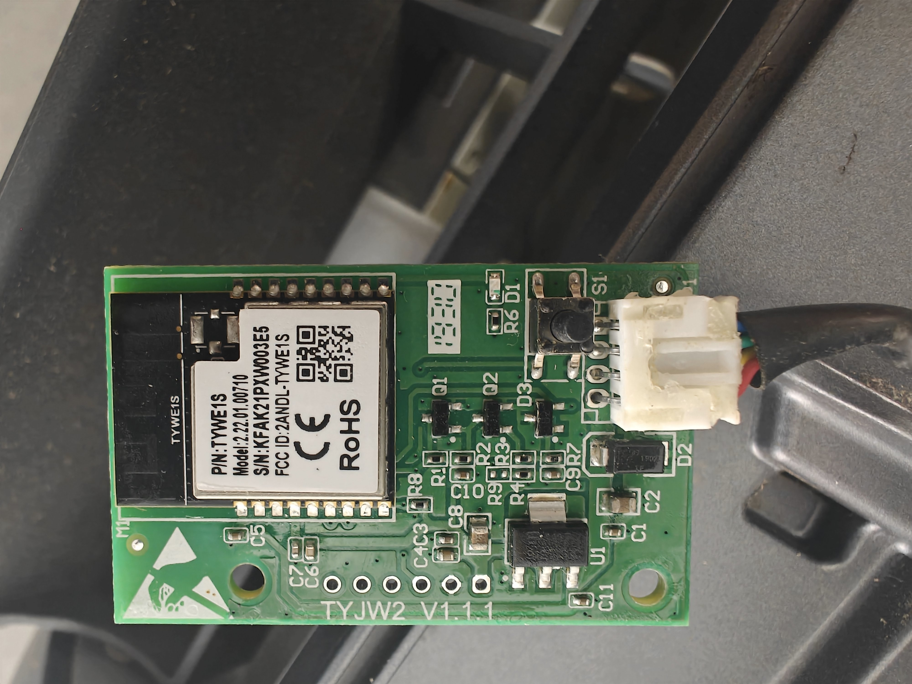

# ESPHome TCL Climate — Johnson JN52N / Tuya AC

[🇪🇸 Versión en castellano](README.es.md)

ESPHome custom component + YAML to control **Tuya** air conditioners that actually use the **proprietary TCL protocol** over UART (not the Tuya MCU).

> Tested on a **Johnson JN52N** with **TYWE1S** module (ESP8266EX, 2 MB flash).



*Johnson JN52N datasheet.*

## Component origin

This package is an **adapted fork** of the community **TCL AC for ESPHome** component.

- **Original repo**: [`Kannix2005/esphome-tcl-ac`](https://github.com/Kannix2005/esphome-tcl-ac)
  Custom ESPHome component based on reverse engineering of the TCL/Realtek RTL8710C AC UART protocol.
- **Earlier reference**: [`I-am-nightingale/tclac`](https://github.com/I-am-nightingale/tclac) — initial TCL protocol variant.

Main modifications from the original:
- Adapted for **TYWE1S** module (`esp01_1m`, 2 MB flash) with UART pins **GPIO15/GPIO13**.
- Presets mapped to ESPHome standards: `ECO`, `SLEEP`, `BOOST` (Turbo).
- Fan exposed with standard modes (`Auto / Low / Medium / High`) for native Home Assistant icon compatibility.
- **Mute** exposed as a template switch because ESPHome does not expose a public setter for custom presets from external custom components.
- Motorized vertical **and horizontal** swing (on/off per axis), mapped by sniffing the UART bus while pressing the physical remote.

## Features

- **Modes**: Cool, Heat, Dry, Fan, Auto
- **Presets**: Eco, Sleep, Boost (Turbo)
- **Fan**: Auto / Low / Medium / High
- **Mute**: independent switch (low speed + mute)
- **Vertical and horizontal swing**: per-axis on/off from the climate card; selects with Fix/Move positions (experimental — the unit does not report vane positions)
- **Temperature**: 16–30 °C
- **UART EVEN parity** (required by TCL protocol)

## Hardware

| Board | Flash | UART to AC |
|---|---|---|
| `esp01_1m` (TYWE1S) | 2 MB | GPIO15 = TX, GPIO13 = RX |

> Other ESP8266/ESP32 modules with the same protocol should work by changing the UART pins.

|  |  |
|---|---|
| *Back of the WiFi board: the flashing pins are labeled. **No soldering needed** — dupont cables held firmly in place work fine while flashing.* | *Front of the board with the TYWE1S module visible, connected to the AC unit.* |

## Repository structure

```text
.
├── ac-jn52n.yaml                   # Main YAML (adjust secrets)
├── components/
│   └── tcl_climate/                # Custom ESPHome component
│       ├── __init__.py
│       ├── climate.py
│       ├── tcl_climate.h
│       └── tcl_climate.cpp
├── firmware/
│   ├── JohnsonJN52N-original_firmware.bin  # Stock Tuya firmware dump (2 MiB)
│   └── ac-jn52n-esphome.bin        # Precompiled ESPHome firmware (no credentials baked in)
└── images/                         # Hardware photos
```

## Backing up the stock firmware (highly recommended)

Before flashing anything, dump the original Tuya firmware. It only takes a few minutes and it is your ticket back to the factory state at any time.

1. With the AC **unplugged from mains**, connect your USB-to-UART adapter to the board's flashing pins: **3V3, GND, TX, RX** (they are labeled on the back of the PCB — see photo above). Dupont cables work; just make sure the contact is firm.
2. Bridge **GPIO0 to GND** and power up the board to enter download mode.
3. Dump the full 2 MiB flash:
   ```bash
   esptool.py --port /dev/ttyUSB0 read_flash 0x0 0x200000 backup.bin
   ```
4. Verify the dump is exactly **2097152 bytes** and keep it safe.

This repo already includes my own stock dump: `firmware/JohnsonJN52N-original_firmware.bin`. It should work on any Johnson JN52N / TCL unit with a TYWE1S, but **dumping your own is still recommended**.

### Restoring the stock firmware

Same wiring, same download mode (GPIO0→GND at power-up):

```bash
esptool.py --port /dev/ttyUSB0 write_flash 0x0 firmware/JohnsonJN52N-original_firmware.bin
```

## Flashing ESPHome

### Option A: precompiled firmware

`firmware/ac-jn52n-esphome.bin` is ready to flash (same wiring and download mode as above):

```bash
esptool.py --port /dev/ttyUSB0 write_flash 0x0 firmware/ac-jn52n-esphome.bin
```

It is compiled **without any Wi-Fi credentials**, so on first boot it goes straight to its fallback AP with captive portal — connect to it and configure your own Wi-Fi from there.

### Option B: compile it yourself

1. Copy the `components/tcl_climate/` folder next to your YAML.
2. Copy `ac-jn52n.yaml` to your ESPHome directory.
3. Define `wifi_ssid` and `wifi_password` in your `secrets.yaml` and adjust `name` / `friendly_name` as desired.
4. Compile and flash:
   ```bash
   esphome run ac-jn52n.yaml
   ```

## OTA updates

The wired flash is only needed once. From then on, update over the air from the ESPHome dashboard or with `esphome run ac-jn52n.yaml`.

## Important notes

- **TCL Protocol**: uses 55/61 byte frames at 9600 baud with EVEN parity. Not compatible with `tuya:` or `midea:`.
- **Eco**: byte 7 bit 6 of the status message.
- **Sleep**: byte 19 bits 6:7 (`0x01` = Default).
- **Turbo/Boost**: separate bit at byte 8 bit 6.
- **Mute**: separate bit in the protocol; exposed as a template switch because ESPHome does not allow `custom_preset` from external custom components.
- **Swing**: status byte 10: bit 6 = vertical on/off, bit 5 = horizontal on/off (found by sniffing the UART bus with the physical remote). In the SET frame: vertical = byte 10 bits 3:5 (`0x07` = on), horizontal = byte 11 bit 3. The unit does not report vane positions (bytes 51/52 always `0xFF`).

## License

AGPL-3.0 — use at your own risk, especially when working with mains voltage.
